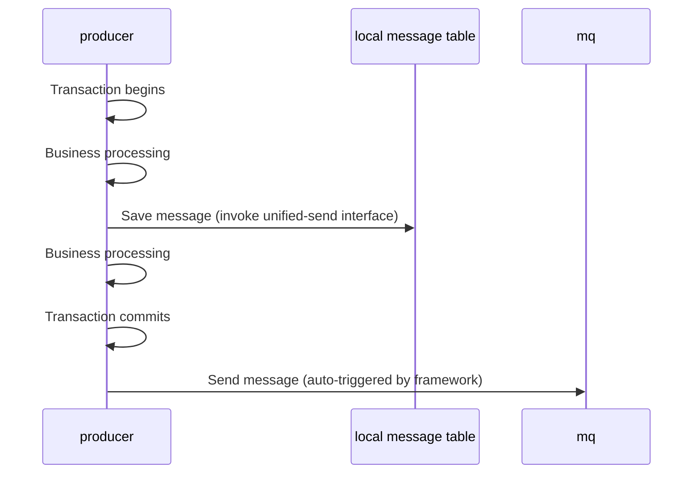
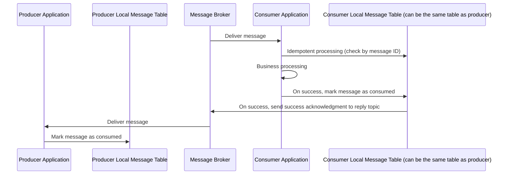
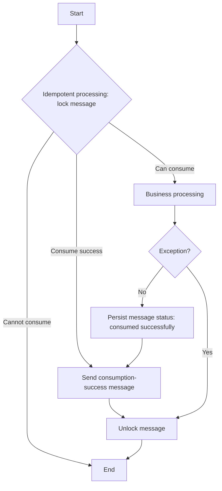
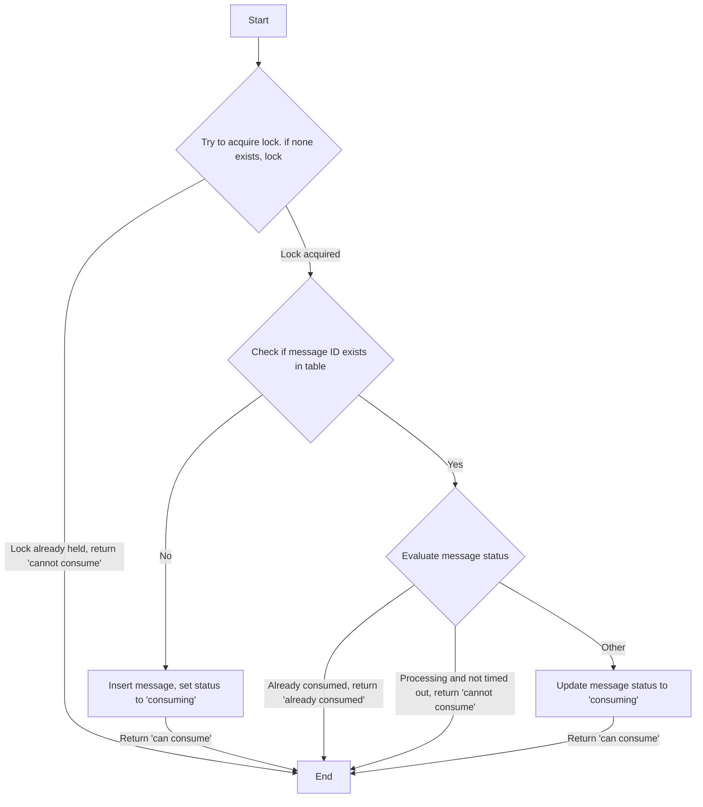
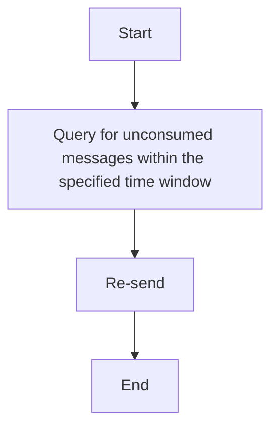

# mq-springboot-reliable

## Introduction
When using MQ message middleware, users often encounter various problems. This framework effectively ensures data consistency by combining local message tables with fallback mechanisms, supporting multiple message middleware including RabbitMQ, RocketMQ, and Kafka.

If this project is helpful to you, please give it a Star. Thank you very much!

## Problem Domain
#### Sending
1. Business fails but message is sent out
2. Thought the interface call would send the message, but it actually failed to send
3. Calling the message sending interface, but synchronous sending has poor performance, and asynchronous sending confirmation processing is complex

#### Consumption
1. Message middleware guarantees "at least once delivery" for the same message, which may result in multiple business processing
2. Delivery failure may cause dead loop consumption or discard exceeding limit and transfer to dead letter queue

## Solution
Core: Local message table + message consumption success confirmation + fallback mechanism (resend message or manual processing for unsuccessful confirmation)

Note: Only confirm when consumption is successful. For unsuccessful consumption, resend after timeout or manual processing


##### Message Sending


1. Message saving and producer business processing are in the same database transaction. Messages are sent after the transaction is committed to ensure data consistency.
2. The framework provides a unified sending interface to automatically send messages after the transaction is committed.
3. The same sending interface requires the following parameters:
- Topic: Required, Topic(RocketMQ)/Exchange(RabbitMQ)
- Tag: Optional, Tag(RocketMQ)/RouteKey(RabbitMQ)
- Callback confirmation topic: Required, Topic(RocketMQ)/Exchange(RabbitMQ)
- Callback confirmation tag: Optional, Tag(RocketMQ)/RouteKey(RabbitMQ)
- Message data: Required, Data
- Business ID: Optional


#### Message Consumption

1.  The message broker guarantees at-least-once delivery.
2.  Perform idempotent processing based on the message ID.
3.  If the producer and consumer share the same database, direct acknowledgment in the database is supported; no confirmation message needs to be sent.

##### Consumer-side message-processing logic


##### Idempotent Processing
Determine whether the message can be consumed.
Returns: consumable, not consumable, or already consumed.




#### Fallback Mechanism

Periodically poll messages that failed to be consumed and re-send them.



1.  On the sender side, query the database directly to retrieve messages that were not consumed successfully (implemented by the user).
2.  The framework provides a unified re-send interface.

## Usage Instructions
### Data Initialization
1. Execute sql/mq_init.sql to initialize the data.
2. If the value of mq.consumer.type is 2, please configure the data in the mq_producer_consume_config table. If not configured, after receiving the confirmation message, since there is no data in the mq_producer_consume_confirm table, the confirmation status of the corresponding message in the mq_producer_message table will be directly set to confirmed.
   The property mq.consumer.type indicates the consumer group type: 1 for single consumer group, 2 for multiple consumer groups.

#### Framework Data Table Usage
For a message, depending on the value of mq.consumer.type, the framework uses two sets of tables:
- When mq.consumer.type is 1, the framework will use the mq_message table.
- When mq.consumer.type is 2, the framework will use the mq_producer_message, mq_producer_consume_config, mq_producer_consume_confirm, and mq_consumer_idempotent tables.


### Property Configuration Description

```aiignore
mq:
  # Message ID prefix, for example, using service name, message ID format is prefix + 32-bit UUID
  id-prefix: demo-
  consumer:
    # Consumer group type, 1 for single consumer group, 2 for multiple consumer groups
    type: 2
    # When configuring the same database, whether confirmation is needed through messages; when producer and consumer belong to the same database (determined by whether the message can be found in the local message table): setting to "true" means confirmation through message confirmation mechanism, setting to "false" means direct confirmation through database
    same-database-confirmation: false
  # Idempotent
  idempotent:
    # Redis idempotent lock prefix, idempotent lock name format is prefix:consumer_group:message_id
    lock-prefix: "mq:idempotent:"
    # Idempotent lock expiration time (seconds)
    expire-time: 5
```

### RabbitMQ
#### Configuration
pom.xml, add framework dependencies

```aiignore
<dependency>
  <groupId>xyz.zhenliang.reliable</groupId>
  <artifactId>mq-springboot-reliable-mybatisplus</artifactId>
  <version>1.0.0</version>
</dependency>
<dependency>
  <groupId>xyz.zhenliang.reliable</groupId>
  <artifactId>mq-springboot-reliable-rabbitmq</artifactId>
  <version>1.0.0</version>
</dependency>
```

Other configurations in pom.xml such as RabbitMQ, JSON, MyBatis Plus, and Redis configuration

```aiignore
<dependency>
  <groupId>org.springframework.boot</groupId>
  <artifactId>spring-boot-starter-amqp</artifactId>
</dependency>
<dependency>
  <groupId>com.fasterxml.jackson.datatype</groupId>
  <artifactId>jackson-datatype-jsr310</artifactId>
</dependency>
<dependency>
  <groupId>com.baomidou</groupId>
  <artifactId>mybatis-plus-boot-starter</artifactId>
</dependency>
<dependency>
  <groupId>org.springframework.boot</groupId>
  <artifactId>spring-boot-starter-data-redis</artifactId>
</dependency>
```

The application.yml configuration file needs to include configurations for components such as JSON, RabbitMQ, MySQL, and Redis. In this document's example, only the configuration sections for RabbitMQ and Jackson (JSON processing) are shown.

```aiignore
spring:
  jackson:
    date-format: yyyy-MM-dd HH:mm:ss
    time-zone: Asia/Shanghai
    serialization:
      write-dates-as-timestamps: false # Disable timestamps
    deserialization:
      fail-on-unknown-properties:  false
  rabbitmq:
    host: localhost
    port: 5672
    username: admin
    password: Demo123
    # Virtual host, default is "/"
    virtual-host: /
    # Enable message confirmation mechanism
    publisher-confirm-type: correlated
    publisher-returns: true
    listener:
      simple:
        # Number of messages prefetched by a single consumer, default is 250 in springboot
        prefetch: 10
        # Consumer concurrency settings
        concurrency: 1
        max-concurrency: 10
        # Consumption retry configuration
        retry:
          enabled: true
          max-attempts: 3
          initial-interval: 1000ms
          multiplier: 2.0
          max-interval: 10000ms
    template:
      # Send retry configuration
      retry:
        enabled: true       # Master switch: whether to enable retry mechanism
        initial-interval: 1000ms  # Initial retry interval (wait 1 second after first failure)
        multiplier: 2       # Interval multiplier (next interval = previous interval * multiplier)
        max-attempts: 3     # Maximum retry attempts (including the first send, total 3 attempts)
        max-interval: 10000ms # Maximum retry interval (no matter how large the calculated value is, it will not exceed 10 seconds)
      # When unable to route to queue, return processing, ReturnCallback will be executed
      mandatory: true
```


#### send
xyz.zhenliang.reliable.mq.core.IMqSender

```aiignore
@Autowired
private IMqSender mqSender;
```

API Specification
```aiignore
    /**
     * Send message to MQ
     *
     * @param topic        Message topic, used to classify message types
     * @param tag          Message tag, used to further refine message classification
     * @param data         Message data content, specific business data
     * @param businessId   Business unique identifier, used for business tracking
     * @param confirmTopic Confirm message topic, used to send confirm messages
     * @param confirmTag   Confirm message tag, used for sending confirm message tags
     * @param <T>          Message data type, supports generics
     * @return MqMsg<T> Message object, contains complete message information
     */
    public <T> MqMsg<T> sendMsg(String topic, String tag, T data, String businessId, String confirmTopic, String confirmTag);
```


demo:reliable-demo/rabbitmq-demo/xyz.zhenliang.reliable.demo.service.impl.DemoService
```aiignore
    public MqMsg<OrderDTO> send(OrderDTO orderDTO) {
        return mqSender.sendMsg(DemoConfig.ORDER_EXCHANGE_NAME, DemoConfig.ORDER_ROUTING_KEY,
                orderDTO, orderDTO.getOrderId(), DemoConfig.CONFIRM_EXCHANGE_NAME, DemoConfig.CONFIRM_ROUTING_KEY);
    }
```

#### consume
xyz.zhenliang.reliable.mq.core.IMqConsumer
```aiignore
@Autowired
private IMqConsumer mqConsumer;
```

API Specification – includes message consumption and message acknowledgment

```aiignore
/**
     * Consume message
     *
     * @param consumerGroup Consumer group
     * @param mqMsg         Message object
     * @param handler       Message handler
     * @param <T>           Message content type
     */
    default <T> void consume(String consumerGroup, MqMsg<T> mqMsg, IMsgHandler<T> handler) {

    }

    /**
     * Consume message
     *
     * @param consumerGroup Consumer group
     * @param mqMsgStr      Message string
     * @param typeReference Message type reference
     * @param handler       Message handler
     * @param <T>           Message content type
     */
    default <T> void consume(String consumerGroup, String mqMsgStr, TypeReference<MqMsg<T>> typeReference, IMsgHandler<T> handler) {

    }

    /**
     * Consumption success confirmation
     *
     * @param mqConsumeConfirmMsg Consumption confirmation message
     */
    default void consumeSuccessConfirm(MqConsumeConfirmMsg mqConsumeConfirmMsg) {

    }

    /**
     * Consumption success confirmation
     *
     * @param mqConsumeConfirmMsgStr Consumption confirmation message string
     */
    default void consumeSuccessConfirm(String mqConsumeConfirmMsgStr) {

    }
```
demo:reliable-demo/rabbitmq-demo/xyz.zhenliang.reliable.demo.consumer.listener.OrderListener
```aiignore
    @RabbitListener(queues = DemoConfig.ORDER_QUEUE_NAME)
    public void handleOrder(MqMsg<OrderDTO> message) {
        mqConsumer.consume(DemoConfig.ORDER_QUEUE_NAME, message, this::handleData);
    }
    public void handleData(MqMsg<OrderDTO> msgDTO) {
        OrderDTO orderDTO = msgDTO.getData();
        orderHandler.handleOrder(orderDTO);
    }
```

```aiignore
    @RabbitListener(queues = DemoConfig.CONFIRM_QUEUE_NAME)
    public void handleConfirm(MqConsumeConfirmMsg message) {
        mqConsumer.consumeSuccessConfirm(message);
    }
```

### rocketmq
#### Configuration
pom.xml, add framework dependencies

```aiignore
<dependency>
  <groupId>xyz.zhenliang.reliable</groupId>
  <artifactId>mq-springboot-reliable-mybatisplus</artifactId>
  <version>1.0.0</version>
</dependency>
<dependency>
  <groupId>xyz.zhenliang.reliable</groupId>
  <artifactId>mq-springboot-reliable-rocketmq</artifactId>
  <version>1.0.0</version>
</dependency>
```

Other configurations in pom.xml such as RabbitMQ, JSON, MyBatis Plus, and Redis configuration

```aiignore
<dependency>
      <groupId>xyz.zhenliang.reliable</groupId>
      <artifactId>mq-springboot-reliable-rocketmq</artifactId>
    </dependency>
<dependency>
  <groupId>com.fasterxml.jackson.datatype</groupId>
  <artifactId>jackson-datatype-jsr310</artifactId>
</dependency>
<dependency>
  <groupId>com.baomidou</groupId>
  <artifactId>mybatis-plus-boot-starter</artifactId>
</dependency>
<dependency>
  <groupId>org.springframework.boot</groupId>
  <artifactId>spring-boot-starter-data-redis</artifactId>
</dependency>
```

The application.yml configuration file needs to include configurations for components such as JSON, Rocketmq, MySQL, and Redis. In this document's example, only the configuration sections for rocketmq and Jackson (JSON processing) are shown.
```aiignore
spring:
  jackson:
    date-format: yyyy-MM-dd HH:mm:ss
    time-zone: Asia/Shanghai
    serialization:
      write-dates-as-timestamps: false # Disable timestamps
    deserialization:
      fail-on-unknown-properties:  false
rocketmq:
  name-server: localhost:9876
  producer:
    group: demo-producer
    # Message sending timeout (milliseconds)
    send-message-timeout: 3000
    # Number of retries when asynchronous sending fails, default is 2
    retry-times-when-send-async-failed: 2
    # Maximum message size (bytes), default is 4MB
    max-message-size: 4194304
```


#### send
xyz.zhenliang.reliable.mq.core.IMqSender

```aiignore
@Autowired
private IMqSender mqSender;
```

API Specification
```aiignore
    /**
     * Send message to MQ
     *
     * @param topic        Message topic, used to classify message types
     * @param tag          Message tag, used to further refine message classification
     * @param data         Message data content, specific business data
     * @param businessId   Business unique identifier, used for business tracking
     * @param confirmTopic Confirm message topic, used to send confirm messages
     * @param confirmTag   Confirm message tag, used for sending confirm message tags
     * @param <T>          Message data type, supports generics
     * @return MqMsg<T> Message object, contains complete message information
     */
    public <T> MqMsg<T> sendMsg(String topic, String tag, T data, String businessId, String confirmTopic, String confirmTag);
```


demo:reliable-demo/rocketmq-demo/xyz.zhenliang.reliable.demo.service.impl.DemoService
```aiignore
    public MqMsg<OrderDTO> send(OrderDTO orderDTO) {
        return mqSender.sendMsg(DemoConfig.ORDER_EXCHANGE_NAME, DemoConfig.ORDER_ROUTING_KEY,
                orderDTO, orderDTO.getOrderId(), DemoConfig.CONFIRM_EXCHANGE_NAME, DemoConfig.CONFIRM_ROUTING_KEY);
    }
```

#### consume
xyz.zhenliang.reliable.mq.core.IMqConsumer
```aiignore
@Autowired
private IMqConsumer mqConsumer;
```

API Specification – includes message consumption and message acknowledgment

```aiignore
/**
     * Consume message
     *
     * @param consumerGroup Consumer group
     * @param mqMsg         Message object
     * @param handler       Message handler
     * @param <T>           Message content type
     */
    default <T> void consume(String consumerGroup, MqMsg<T> mqMsg, IMsgHandler<T> handler) {

    }

    /**
     * Consume message
     *
     * @param consumerGroup Consumer group
     * @param mqMsgStr      Message string
     * @param typeReference Message type reference
     * @param handler       Message handler
     * @param <T>           Message content type
     */
    default <T> void consume(String consumerGroup, String mqMsgStr, TypeReference<MqMsg<T>> typeReference, IMsgHandler<T> handler) {

    }

    /**
     * Consumption success confirmation
     *
     * @param mqConsumeConfirmMsg Consumption confirmation message
     */
    default void consumeSuccessConfirm(MqConsumeConfirmMsg mqConsumeConfirmMsg) {

    }

    /**
     * Consumption success confirmation
     *
     * @param mqConsumeConfirmMsgStr Consumption confirmation message string
     */
    default void consumeSuccessConfirm(String mqConsumeConfirmMsgStr) {

    }
```
demo:reliable-demo/rocketmq-demo/xyz.zhenliang.reliable.demo.consumer.listener.OrderListener
```aiignore
@RocketMQMessageListener(
        topic = DemoConstant.ORDER_TOPIC,
        consumerGroup = DemoConstant.ORDER_CONSUMER_GROUP
)
@Component
public class OrderListener implements RocketMQListener<MqMsg<OrderDTO>> {
    private static final Logger log = LoggerFactory.getLogger(OrderListener.class);
    @Autowired
    private OrderHandler orderHandler;
    @Autowired
    private IMqConsumer mqConsumer;

    /**
     * Process received order messages
     *
     * @param message Order message object containing order data and message related information
     */
    @Override
    public void onMessage(MqMsg<OrderDTO> message) {
        // Call the common message consumption method to process order messages
        mqConsumer.consume(DemoConstant.ORDER_CONSUMER_GROUP, message, this::handleData);
    }

    /**
     * Business logic for actually processing order data
     *
     * @param msgDTO Message object containing order data
     */
    public void handleData(MqMsg<OrderDTO> msgDTO) {
        OrderDTO orderDTO = msgDTO.getData();
        //if(true) throw new RuntimeException("xxxx");
        // Call the order processor to handle specific order business logic
        orderHandler.handleOrder(orderDTO);
    }
}
```

```aiignore
@RocketMQMessageListener(
        topic = DemoConstant.CONFIRM_TOPIC,
        consumerGroup = DemoConstant.CONFIRM_CONSUMER_GROUP
)
@Component
public class ConfirmListener implements RocketMQListener<MqConsumeConfirmMsg> {
    private static final Logger log = LoggerFactory.getLogger(ConfirmListener.class);

    @Autowired
    private IMqConsumer mqConsumer;

    /**
     * Listen and process consumption confirmation messages
     *
     * @param message consumption confirmation message object
     */
    @Override
    public void onMessage(MqConsumeConfirmMsg message) {
        // Call the MQ consumer component to handle successful consumption confirmation logic
        mqConsumer.consumeSuccessConfirm(message);
    }
}
```

### kafka
#### Configuration
pom.xml, add framework dependencies

```aiignore
<dependency>
  <groupId>xyz.zhenliang.reliable</groupId>
  <artifactId>mq-springboot-reliable-mybatisplus</artifactId>
  <version>1.0.0</version>
</dependency>
<dependency>
  <groupId>xyz.zhenliang.reliable</groupId>
  <artifactId>mq-springboot-reliable-kafka</artifactId>
  <version>1.0.0</version>
</dependency>
```

Other configurations in pom.xml such as kafka, JSON, MyBatis Plus, and Redis configuration

```aiignore
<dependency>
  <groupId>org.springframework.kafka</groupId>
  <artifactId>spring-kafka</artifactId>
</dependency>
<dependency>
  <groupId>com.fasterxml.jackson.datatype</groupId>
  <artifactId>jackson-datatype-jsr310</artifactId>
</dependency>
<dependency>
  <groupId>com.baomidou</groupId>
  <artifactId>mybatis-plus-boot-starter</artifactId>
</dependency>
<dependency>
  <groupId>org.springframework.boot</groupId>
  <artifactId>spring-boot-starter-data-redis</artifactId>
</dependency>
```

The application.yml configuration file needs to include configurations for components such as JSON, kafka, MySQL, and Redis. In this document's example, only the configuration sections for kafka and Jackson (JSON processing) are shown.
```aiignore
spring:
  jackson:
    date-format: yyyy-MM-dd HH:mm:ss
    time-zone: Asia/Shanghai
    serialization:
      write-dates-as-timestamps: false # Disable timestamps
    deserialization:
      fail-on-unknown-properties:  false
    kafka:
    # Kafka address
    bootstrap-servers: localhost:9094
    # Producer configuration
    producer:
      # Message acknowledgment mechanism
      acks: all # or -1, ensure message is fully acknowledged
      # Retry configuration
      retries: 2
      # Batch size in bytes (32KB), Kafka will batch multiple messages to improve throughput
      batch-size: 32768
      # Producer buffer memory in bytes (32MB), messages will be temporarily stored in this buffer when producer sends faster than Kafka can process
      buffer-memory: 33554432
      # Message serialization
      key-serializer: org.apache.kafka.common.serialization.StringSerializer
      value-serializer: org.apache.kafka.common.serialization.StringSerializer
      properties:
        # Maximum time producer waits for Kafka broker response
        request.timeout.ms: 40000
        # Message delivery timeout, 3 minutes
        delivery.timeout.ms: 180000
        # Message compression algorithm, using zstd algorithm to compress messages
        compression.type: zstd
        # Ensure 4MB messages can be sent
        max.request.size: 5242880 # 5MB
    consumer:
      properties:
        # Session timeout
        session.timeout.ms: 30000
        # Poll timeout
        max.poll.interval.ms: 300000
        # Fetch size
        max.partition.fetch.bytes: 4194304 # 4MB
```

#### send
xyz.zhenliang.reliable.mq.core.IMqSender

```aiignore
@Autowired
private IMqSender mqSender;
```

API Specification
```aiignore
    /**
     * Send message to MQ
     *
     * @param topic        Message topic, used to classify message types
     * @param tag          Message tag, used to further refine message classification
     * @param data         Message data content, specific business data
     * @param businessId   Business unique identifier, used for business tracking
     * @param confirmTopic Confirm message topic, used to send confirm messages
     * @param confirmTag   Confirm message tag, used for sending confirm message tags
     * @param <T>          Message data type, supports generics
     * @return MqMsg<T> Message object, contains complete message information
     */
    public <T> MqMsg<T> sendMsg(String topic, String tag, T data, String businessId, String confirmTopic, String confirmTag);
```


demo:reliable-demo/kafka-demo/xyz.zhenliang.reliable.demo.service.impl.DemoService
```aiignore
    public MqMsg<OrderDTO> send(OrderDTO orderDTO) {
        return mqSender.sendMsg(DemoConstant.ORDER_TOPIC, DemoConstant.ORDER_TAG,
                orderDTO, orderDTO.getOrderId(), DemoConstant.CONFIRM_TOPIC, DemoConstant.ORDER_TAG);
    }
```
#### consume
xyz.zhenliang.reliable.mq.core.IMqConsumer
```aiignore
@Autowired
private IMqConsumer mqConsumer;
```

API Specification – includes message consumption and message acknowledgment

```aiignore
/**
     * Consume message
     *
     * @param consumerGroup Consumer group
     * @param mqMsg         Message object
     * @param handler       Message handler
     * @param <T>           Message content type
     */
    default <T> void consume(String consumerGroup, MqMsg<T> mqMsg, IMsgHandler<T> handler) {

    }

    /**
     * Consume message
     *
     * @param consumerGroup Consumer group
     * @param mqMsgStr      Message string
     * @param typeReference Message type reference
     * @param handler       Message handler
     * @param <T>           Message content type
     */
    default <T> void consume(String consumerGroup, String mqMsgStr, TypeReference<MqMsg<T>> typeReference, IMsgHandler<T> handler) {

    }

    /**
     * Consumption success confirmation
     *
     * @param mqConsumeConfirmMsg Consumption confirmation message
     */
    default void consumeSuccessConfirm(MqConsumeConfirmMsg mqConsumeConfirmMsg) {

    }

    /**
     * Consumption success confirmation
     *
     * @param mqConsumeConfirmMsgStr Consumption confirmation message string
     */
    default void consumeSuccessConfirm(String mqConsumeConfirmMsgStr) {

    }
```

demo:reliable-demo/kafka-demo/xyz.zhenliang.reliable.demo.consumer.listener.OrderListener
```aiignore
    @KafkaListener(
            topics = DemoConstant.ORDER_TOPIC,
            groupId = DemoConstant.ORDER_CONSUMER_GROUP
    )
    public void handleOrder(@Payload String message) {
        mqConsumer.consume(DemoConstant.ORDER_CONSUMER_GROUP, message
                , new TypeReference<MqMsg<OrderDTO>>() {
                }, this::handleData);
    }
    public void handleData(MqMsg<OrderDTO> msgDTO) {
        OrderDTO orderDTO = msgDTO.getData();
        //if(true) throw new RuntimeException("xxxx");
        orderHandler.handleOrder(orderDTO);
    }
```

```aiignore
    @KafkaListener(
            topics = DemoConstant.CONFIRM_TOPIC,
            groupId = DemoConstant.CONFIRM_CONSUMER_GROUP
    )
    public void handleConfirm(@Payload String message) {
        mqConsumer.consumeSuccessConfirm(message);
    }
```


### Fallback
#### Unconfirmed Message Query
Property mq.consumer.type, consumer group type, 1 for single consumer group, 2 for multiple consumer groups.
``aiignore
1 for single consumer group
select * from mq_message where confirm_status=0
```
```aiignore
2 for multiple consumer groups.
SELECT * FROM mq_producer_message where confirm_status=0
```
#### Resend
Code injection interface xyz.zhenliang.reliable.mq.core.IMqSender
```aiignore
@Autowired
private IMqSender mqSender;
```
Sending interface description:
```aiignore
    /**
     * Resend message based on message ID
     *
     * @param msgId Unique message identifier, used to locate the message to be resent
     */
    public void resendMsg(String msgId);
```

## Framework Design
#### Code Structure
reliable-main (parent module)
- reliable-commons (common module, encapsulates utility classes, etc.)
- reliable-core (core module, encapsulates the overall framework structure, depends on reliable-commons)
- reliable-mq (message queue module, encapsulates message queue related code, depends on reliable-core, implements IMqProducer interface)
    - reliable-mq-rabbitmq (rabbitmq implementation)
    - reliable-mq-rocketmq (rocketmq implementation)
    - reliable-mq-kafka (kafka implementation)
- reliable-persistence (persistence)
    - reliable-persistence-mybatisplue (persistence through mybatis, implements IMqIdempotent and IMqPersister interfaces)
#### Table Structure Description
For a message, two sets of tables are divided according to the value of mq.consumer.type. It supports producers and consumers connecting to different databases.
- When mq.consumer.type value is 1, a message will only be consumed by one consumer

  | Table | Name | Description |
      |-----------|---------|-----------------------------------|
  | mq_message | MQ Message Table | Local data is written when sending, consumption (idempotent and success flag) and consumption confirmation are all performed in this table |

- When mq.consumer.type value is 2, a message will only be consumed by one consumer, but message consumption confirmation needs to consider multiple consumer scenarios

  | Table | Name | Description |
      |---------|---------|------------------------------------------------------------|
  | mq_producer_consume_config | MQ Producer Consumption Configuration Table | Manual configuration |
  | mq_producer_message | MQ Message Table | Data is written when sending, the confirmation status of this table will be modified when all consumption is completed (based on the unconfirmed quantity in mq_producer_consume_confirm) |
  | mq_producer_consume_confirm | MQ Producer Consumption Confirmation Table | Data is written into this table according to the configuration table when sending, consumption confirmation will modify the confirmation status in the table |
  | mq_consumer_idempotent | MQ Consumer Idempotent Table | Written during consumption, used for idempotent judgment, both successful and failed consumption will modify the status of this table |


#### 
## Example Description
#### Code Structure
reliable-demo (parent module of the example, with the following child modules)
- demo-core (core module of the example)
- rabbitmq-demo (depends on the core module, encapsulates rabbitmq related code)
- rocketmq-demo (depends on the core module, encapsulates rocketmq related code)
- kafka-demo (depends on the core module, encapsulates kafka related code)

#### RabbitMQ Example
Middleware Deployment

```aiignore
cd deploy
docker compose -f docker-compose-rabbitmq.yml up -d
```
Start Application

```aiignore
xyz.zhenliang.reliable.demo.DemoRabbitmqApplication
```
Access the application API interface at the following URL: open the “MQ示例” menu and try invoking the Send Message and Resend Message endpoints.
```aiignore
http://localhost:10000/doc.html
See the screenshots in docs/images.
```
rabbitmq Management Console
```aiignore
http://localhost:15672
admin/Demo123
```

#### RocketMQ Example
Middleware Deployment
Start the middleware
```aiignore
cd deploy
docker compose -f docker-compose-rocketmq.yml up -d
```
Start Application

```aiignore
xyz.zhenliang.reliable.demo.DemoRocketmqApplication
```
Access the application API interface at the following URL: open the “MQ示例” menu and try invoking the Send Message and Resend Message endpoints.
```aiignore
http://localhost:10000/doc.html
See the screenshots in docs/images.
```
RocketMQ Management Console
```aiignore
http://localhost:18080/
```

#### kafka Example
Middleware Deployment
```aiignore
cd deploy
docker compose -f docker-compose-kafka.yml up -d
```
Start Application

```aiignore
xyz.zhenliang.reliable.demo.DemoKafkaApplication
```
Access the application API interface at the following URL: open the “MQ示例” menu and try invoking the Send Message and Resend Message endpoints.
```aiignore
http://localhost:10000/doc.html
See the screenshots in docs/images.
```
kafka Management Console
```aiignore
http://localhost:18082/
```
