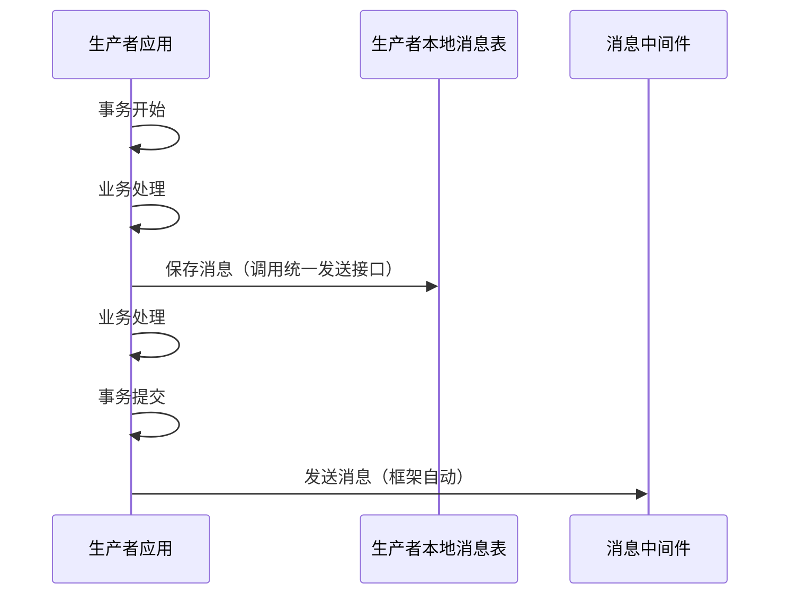
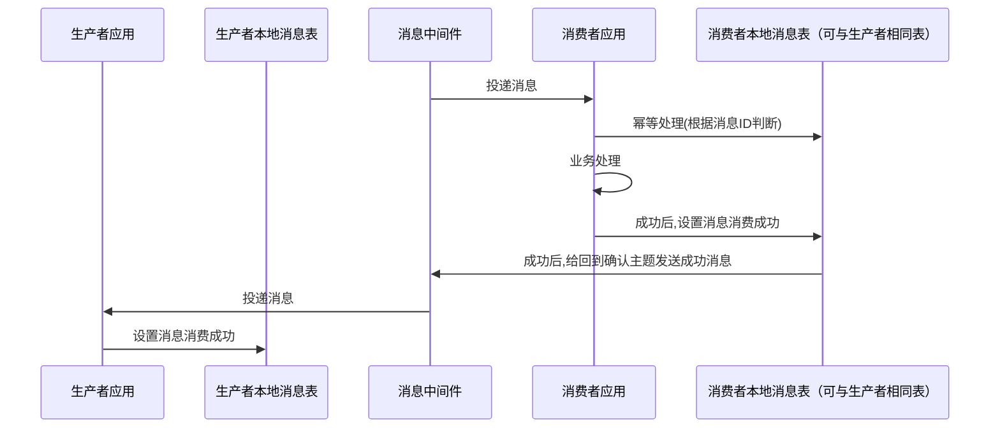
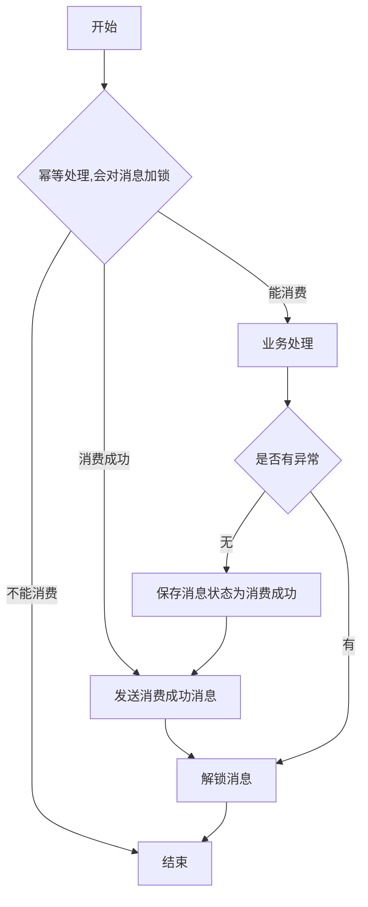
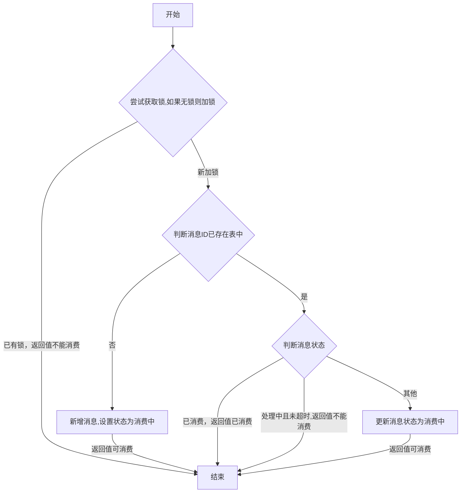
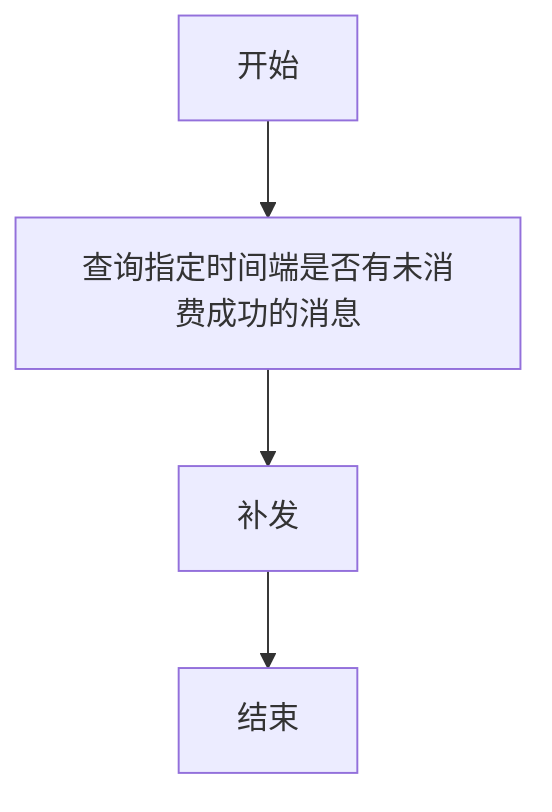

# mq-springboot-reliable

## 介绍
在使用MQ消息中间件时，用户经常会遇到各种问题。本框架通过 本地消息表+兜底机制 相结合的方式，有效保障数据一致性，支持RabbitMQ、RocketMQ、Kafka等多种消息中间件的处理。

如果本项目对您有所帮助，请帮忙点个 Star 支持一下,非常感谢！

## 问题域
#### 发送
  1.  业务失败但消息发出了
  2.  以为调用接口就发送出去了，但是实际未发送成功
  3.  调用消息发送接口，但同步发送性能差，异步发送确认处理复杂

#### 消费
  1.  消息中间件保障对同一消息“至少投递一次”，可能会出现多次业务处理
  2.  投递失败，可能出现死循环消费或者超限丢弃转死信队列

## 解决方案
核心：本地消息表+消息消费成功确认+兜底机制（未成功确认补发消息或人工处理）

注意：只有消费成功才会确认，对未消费成功进行超时补发或人工处理
##### 消息发送

1.  消息保存和生产者业务处理在同一个数据库事务里面，事务提交后再发送消息，保证数据一致性
2.  框架提供同一个发送接口，统一处理发送消息，会自动在在事务提交后发送消息
3.  同一个发送接口，需要传入如下参数： 
  -  主题：必须，Topic(rockemq)/Exchange(rabbitmq)
  -  标签: 可选，Tag(rockemq)/RouteKey(rabbitmq)
  -  回调确认主题：必须，Topic(rockemq)/Exchange(rabbitmq)
  -  回调确认标签：可选，Tag(rockemq)/RouteKey(rabbitmq)
  -  消息数据：必须，Data
  -  业务ID: 可选

#### 消息消费

1.  消息中间件保障至少投递一次
2.  根据消息ID做幂等处理
3.  如果是生产者和消费者是同一数据库，支持直接数据库中确认，不需要通过发送确认消息
##### 消费者端消费处理逻辑


##### 幂等处理
判断消息是否可以进行消费。返回可消费，不能消费，消费成功。

#### 兜底机制
定时轮询未消费成功的消息进行补发

1.  在发送者端直接查库，获取未消费成功的消息（用户自己编写）
2.  框架提供统一的重发接口

## 使用说明
### 数据初始化
1.  执行sql/mq_init.sql，初始化数据。
2.  如果mq.consumer.type值为2，请配置mq_producer_consume_config表中的数据，如果不配置，在收到确认消息后，由于mq_producer_consume_confirm表中没有数据，将会直接将mq_producer_message表中对应消息的确认状态直接设置为确认。
属性mq.consumer.type，消费者组类型,1表示单一消费者组，2表示多个消费者组。

#### 框架对数据表使用
对于一个消息，根据mq.consumer.type的值分了两套表
- mq.consumer.type值为1，框架会使用表mq_message。
- mq.consumer.type值为2，框架会使用表mq_producer_message、mq_producer_consume_config、mq_producer_consume_confirm、mq_consumer_idempotent。
### 属性配置说明
```aiignore
mq:
  # 消息ID前缀，比如使用服务名，消息ID为 前缀+32位UUID
  id-prefix: demo-
  consumer:
    # 消费者组类型,1表示单一消费者组，2表示多个消费者组
    type: 2
    # 配置同库时，是否需要通过消息进行确认；当生产者和消费者属于同一数据库（根据在本地消息表是否可以查到消息判断）：设置为"true"表示通过消息确认机制进行确认，设置为"false"表示直接通过数据库确认
    same-database-confirmation: false
  # 幂等
  idempotent:
    # redis幂等锁前缀,幂等锁名称为 前缀:消费者组:消息ID
    lock-prefix: "mq:idempotent:"
    # 幂等锁过期时间（秒）
    expire-time: 5
```

### rabbitmq
#### 配置 
pom.xml,增加对框架依赖
```aiignore
<dependency>
  <groupId>xyz.zhenliang.reliable</groupId>
  <artifactId>mq-springboot-reliable-mybatisplus</artifactId>
  <version>1.0.0</version>
</dependency>
<dependency>
  <groupId>xyz.zhenliang.reliable</groupId>
  <artifactId>mq-springboot-reliable-rabbitmq</artifactId>
  <version>1.0.0</version>
</dependency>
```
pom.xml中其他配置如Rabbitmq、JSON、mybatis plus、Redis配置
```aiignore
<dependency>
  <groupId>org.springframework.boot</groupId>
  <artifactId>spring-boot-starter-amqp</artifactId>
</dependency>
<dependency>
  <groupId>com.fasterxml.jackson.datatype</groupId>
  <artifactId>jackson-datatype-jsr310</artifactId>
</dependency>
<dependency>
  <groupId>com.baomidou</groupId>
  <artifactId>mybatis-plus-boot-starter</artifactId>
</dependency>
<dependency>
  <groupId>org.springframework.boot</groupId>
  <artifactId>spring-boot-starter-data-redis</artifactId>
</dependency>
```
application.yml配置文件需要包含JSON、RabbitMQ、MySQL、Redis等相关组件的配置，本文档示例中仅展示RabbitMQ和Jackson（JSON处理）的配置部分。
```aiignore
spring:
  jackson:
    date-format: yyyy-MM-dd HH:mm:ss
    time-zone: Asia/Shanghai
    serialization:
      write-dates-as-timestamps: false # 禁用时间戳
    deserialization:
      fail-on-unknown-properties:  false
  rabbitmq:
    host: localhost
    port: 5672
    username: admin
    password: Demo123
    # 虚拟主机，默认是"/"
    virtual-host: /
    # 开启消息确认机制
    publisher-confirm-type: correlated
    publisher-returns: true
    listener:
      simple:
        # 单个消费者预取消息个数，springboot默认250
        prefetch: 10
        # 消费者并发设置
        concurrency: 1
        max-concurrency: 10
        # 消费重试配置
        retry:
          enabled: true
          max-attempts: 3
          initial-interval: 1000ms
          multiplier: 2.0
          max-interval: 10000ms
    template:
      # 发送重试配置
      retry:
        enabled: true       # 总开关：是否启用重试机制
        initial-interval: 1000ms  # 首次重试的间隔时间（第一次失败后等1秒再试）
        multiplier: 2       # 间隔乘数（下一次的间隔 = 上一次间隔 * multiplier）
        max-attempts: 3     # 最大重试次数（包括第一次发送，总共尝试3次）
        max-interval: 10000ms # 最大重试间隔（无论乘数计算出的值多大，都不会超过10秒）
      # 无法路由到队列，返回处理，会执行ReturnCallback
      mandatory: true
```

#### 发送
代码注入接口xyz.zhenliang.reliable.mq.core.IMqSender
```aiignore
@Autowired
private IMqSender mqSender;
```
发送接口说明：
```aiignore
    /**
     * 发送消息到MQ
     *
     * @param topic        消息主题，用于分类消息类型
     * @param tag          消息标签，用于进一步细化消息分类
     * @param data         消息数据内容，具体业务数据
     * @param businessId   业务唯一标识，用于业务追踪
     * @param confirmTopic 确认消息主题，用于发送确认消息
     * @param confirmTag   确认消息标签，用于发送确认消息的标签
     * @param <T>          消息数据类型，支持泛型
     * @return MqMsg<T> 消息对象，包含消息的完整信息
     */
    public <T> MqMsg<T> sendMsg(String topic, String tag, T data, String businessId, String confirmTopic, String confirmTag);
```
使用示例reliable-demo/rabbitmq-demo/xyz.zhenliang.reliable.demo.service.impl.DemoService
```aiignore
    public MqMsg<OrderDTO> send(OrderDTO orderDTO) {
        return mqSender.sendMsg(DemoConfig.ORDER_EXCHANGE_NAME, DemoConfig.ORDER_ROUTING_KEY,
                orderDTO, orderDTO.getOrderId(), DemoConfig.CONFIRM_EXCHANGE_NAME, DemoConfig.CONFIRM_ROUTING_KEY);
    }
```

#### 消费
代码注入接口xyz.zhenliang.reliable.mq.core.IMqConsumer
```aiignore
@Autowired
private IMqConsumer mqConsumer;
```
接口说明，包含消息消费、消息确认
```aiignore
    /**
     * 消费消息
     *
     * @param consumerGroup 消费者组
     * @param mqMsg         消息对象
     * @param handler       消息处理器
     * @param <T>           消息内容类型
     */
    default <T> void consume(String consumerGroup, MqMsg<T> mqMsg, IMsgHandler<T> handler) {

    }

    /**
     * 消费消息
     *
     * @param consumerGroup 消费者组
     * @param mqMsgStr      消息字符串
     * @param typeReference 消息类型引用
     * @param handler       消息处理器
     * @param <T>           消息内容类型
     */
    default <T> void consume(String consumerGroup, String mqMsgStr, TypeReference<MqMsg<T>> typeReference, IMsgHandler<T> handler) {

    }

    /**
     * 消费成功确认
     *
     * @param mqConsumeConfirmMsg 消费确认消息
     */
    default void consumeSuccessConfirm(MqConsumeConfirmMsg mqConsumeConfirmMsg) {

    }

    /**
     * 消费成功确认
     *
     * @param mqConsumeConfirmMsgStr 消费确认消息字符串
     */
    default void consumeSuccessConfirm(String mqConsumeConfirmMsgStr) {

    }
```

消费示例reliable-demo/rabbitmq-demo/xyz.zhenliang.reliable.demo.consumer.listener.OrderListener
```aiignore
    @RabbitListener(queues = DemoConfig.ORDER_QUEUE_NAME)
    public void handleOrder(MqMsg<OrderDTO> message) {
        mqConsumer.consume(DemoConfig.ORDER_QUEUE_NAME, message, this::handleData);
    }
    public void handleData(MqMsg<OrderDTO> msgDTO) {
        OrderDTO orderDTO = msgDTO.getData();
        orderHandler.handleOrder(orderDTO);
    }
```
消费确认示例reliable-demo/rabbitmq-demo/xyz.zhenliang.reliable.demo.consumer.listener.OrderListener
```aiignore
    @RabbitListener(queues = DemoConfig.CONFIRM_QUEUE_NAME)
    public void handleConfirm(MqConsumeConfirmMsg message) {
        mqConsumer.consumeSuccessConfirm(message);
    }
```
### rocketmq
#### 配置
pom.xml,增加对框架依赖
```aiignore
<dependency>
  <groupId>xyz.zhenliang.reliable</groupId>
  <artifactId>mq-springboot-reliable-mybatisplus</artifactId>
  <version>1.0.0</version>
</dependency>
<dependency>
  <groupId>xyz.zhenliang.reliable</groupId>
  <artifactId>mq-springboot-reliable-rocketmq</artifactId>
  <version>1.0.0</version>
</dependency>
```
pom.xml中其他配置如rocketmq、JSON、mybatis plus、Redis配置
```aiignore
<dependency>
      <groupId>xyz.zhenliang.reliable</groupId>
      <artifactId>mq-springboot-reliable-rocketmq</artifactId>
    </dependency>
<dependency>
  <groupId>com.fasterxml.jackson.datatype</groupId>
  <artifactId>jackson-datatype-jsr310</artifactId>
</dependency>
<dependency>
  <groupId>com.baomidou</groupId>
  <artifactId>mybatis-plus-boot-starter</artifactId>
</dependency>
<dependency>
  <groupId>org.springframework.boot</groupId>
  <artifactId>spring-boot-starter-data-redis</artifactId>
</dependency>
```
application.yml配置文件需要包含JSON、rocketmq、MySQL、Redis等相关组件的配置，本文档示例中仅展示rocketmq和Jackson（JSON处理）的配置部分。
```aiignore
spring:
  jackson:
    date-format: yyyy-MM-dd HH:mm:ss
    time-zone: Asia/Shanghai
    serialization:
      write-dates-as-timestamps: false # 禁用时间戳
    deserialization:
      fail-on-unknown-properties:  false
rocketmq:
  name-server: localhost:9876
  producer:
    group: demo-producer
    # 发送消息超时时间(毫秒)
    send-message-timeout: 3000
    # 异步发送失败重试次数，默认为2
    retry-times-when-send-async-failed: 2
    # 消息最大大小(字节)，默认4MB
    max-message-size: 4194304
```

#### 发送
代码注入接口xyz.zhenliang.reliable.mq.core.IMqSender
```aiignore
@Autowired
private IMqSender mqSender;
```
发送接口说明：
```aiignore
    /**
     * 发送消息到MQ
     *
     * @param topic        消息主题，用于分类消息类型
     * @param tag          消息标签，用于进一步细化消息分类
     * @param data         消息数据内容，具体业务数据
     * @param businessId   业务唯一标识，用于业务追踪
     * @param confirmTopic 确认消息主题，用于发送确认消息
     * @param confirmTag   确认消息标签，用于发送确认消息的标签
     * @param <T>          消息数据类型，支持泛型
     * @return MqMsg<T> 消息对象，包含消息的完整信息
     */
    public <T> MqMsg<T> sendMsg(String topic, String tag, T data, String businessId, String confirmTopic, String confirmTag);
```
使用示例reliable-demo/rocketmq-demo/xyz.zhenliang.reliable.demo.service.impl.DemoService
```aiignore
    public MqMsg<OrderDTO> send(OrderDTO orderDTO) {
        return mqSender.sendMsg(DemoConstant.ORDER_TOPIC, DemoConstant.ORDER_TAG,
                orderDTO, orderDTO.getOrderId(), DemoConstant.CONFIRM_TOPIC, DemoConstant.ORDER_TAG);
    }
```

#### 消费
代码注入接口xyz.zhenliang.reliable.mq.core.IMqConsumer
```aiignore
@Autowired
private IMqConsumer mqConsumer;
```
接口说明，包含消息消费、消息确认
```aiignore
    /**
     * 消费消息
     *
     * @param consumerGroup 消费者组
     * @param mqMsg         消息对象
     * @param handler       消息处理器
     * @param <T>           消息内容类型
     */
    default <T> void consume(String consumerGroup, MqMsg<T> mqMsg, IMsgHandler<T> handler) {

    }

    /**
     * 消费消息
     *
     * @param consumerGroup 消费者组
     * @param mqMsgStr      消息字符串
     * @param typeReference 消息类型引用
     * @param handler       消息处理器
     * @param <T>           消息内容类型
     */
    default <T> void consume(String consumerGroup, String mqMsgStr, TypeReference<MqMsg<T>> typeReference, IMsgHandler<T> handler) {

    }

    /**
     * 消费成功确认
     *
     * @param mqConsumeConfirmMsg 消费确认消息
     */
    default void consumeSuccessConfirm(MqConsumeConfirmMsg mqConsumeConfirmMsg) {

    }

    /**
     * 消费成功确认
     *
     * @param mqConsumeConfirmMsgStr 消费确认消息字符串
     */
    default void consumeSuccessConfirm(String mqConsumeConfirmMsgStr) {

    }
```

消费示例reliable-demo/rocketmq-demo/xyz.zhenliang.reliable.demo.consumer.listener.OrderListener
```aiignore
@RocketMQMessageListener(
        topic = DemoConstant.ORDER_TOPIC,
        consumerGroup = DemoConstant.ORDER_CONSUMER_GROUP
)
@Component
public class OrderListener implements RocketMQListener<MqMsg<OrderDTO>> {
    private static final Logger log = LoggerFactory.getLogger(OrderListener.class);
    @Autowired
    private OrderHandler orderHandler;
    @Autowired
    private IMqConsumer mqConsumer;

    /**
     * 处理接收到的订单消息
     *
     * @param message 订单消息对象，包含订单数据和消息相关信息
     */
    @Override
    public void onMessage(MqMsg<OrderDTO> message) {
        // 调用通用的消息消费方法，处理订单消息
        mqConsumer.consume(DemoConstant.ORDER_CONSUMER_GROUP, message, this::handleData);
    }

    /**
     * 实际处理订单数据的业务逻辑
     *
     * @param msgDTO 包含订单数据的消息对象
     */
    public void handleData(MqMsg<OrderDTO> msgDTO) {
        OrderDTO orderDTO = msgDTO.getData();
        //if(true) throw new RuntimeException("xxxx");
        // 调用订单处理器处理具体的订单业务逻辑
        orderHandler.handleOrder(orderDTO);
    }
}
```
消费确认示例reliable-demo/rocketmq-demo/xyz.zhenliang.reliable.demo.consumer.listener.ConfirmListener
```aiignore
@RocketMQMessageListener(
        topic = DemoConstant.CONFIRM_TOPIC,
        consumerGroup = DemoConstant.CONFIRM_CONSUMER_GROUP
)
@Component
public class ConfirmListener implements RocketMQListener<MqConsumeConfirmMsg> {
    private static final Logger log = LoggerFactory.getLogger(ConfirmListener.class);

    @Autowired
    private IMqConsumer mqConsumer;

    /**
     * 监听并处理消费确认消息
     *
     * @param message 消费确认消息对象
     */
    @Override
    public void onMessage(MqConsumeConfirmMsg message) {
        // 调用MQ消费者组件处理消费成功的确认逻辑
        mqConsumer.consumeSuccessConfirm(message);
    }
}
```

### kafka
#### 配置
pom.xml,增加对框架依赖
```aiignore
<dependency>
  <groupId>xyz.zhenliang.reliable</groupId>
  <artifactId>mq-springboot-reliable-mybatisplus</artifactId>
  <version>1.0.0</version>
</dependency>
<dependency>
  <groupId>xyz.zhenliang.reliable</groupId>
  <artifactId>mq-springboot-reliable-kafka</artifactId>
  <version>1.0.0</version>
</dependency>
```
pom.xml中其他配置如kafka、JSON、mybatis plus、Redis配置
```aiignore
<dependency>
  <groupId>org.springframework.kafka</groupId>
  <artifactId>spring-kafka</artifactId>
</dependency>
<dependency>
  <groupId>com.fasterxml.jackson.datatype</groupId>
  <artifactId>jackson-datatype-jsr310</artifactId>
</dependency>
<dependency>
  <groupId>com.baomidou</groupId>
  <artifactId>mybatis-plus-boot-starter</artifactId>
</dependency>
<dependency>
  <groupId>org.springframework.boot</groupId>
  <artifactId>spring-boot-starter-data-redis</artifactId>
</dependency>
```
application.yml配置文件需要包含JSON、kafka、MySQL、Redis等相关组件的配置，本文档示例中仅展示RabbitMQ和Jackson（JSON处理）的配置部分。
```aiignore
spring:
  jackson:
    date-format: yyyy-MM-dd HH:mm:ss
    time-zone: Asia/Shanghai
    serialization:
      write-dates-as-timestamps: false # 禁用时间戳
    deserialization:
      fail-on-unknown-properties:  false
    kafka:
    # Kafka地址
    bootstrap-servers: localhost:9094
    # 生产者配置
    producer:
      # 消息确认机制
      acks: all # 或 -1，确保消息被完全确认
      # 重试配置
      retries: 2
      # 批处理大小，单位为字节(32KB)，Kafka 会将多个消息打包成批次发送以提高吞吐量
      batch-size: 32768
      # 生产者缓冲区大小，单位为字节(32MB),当生产者发送速度超过 Kafka 处理速度时，消息会暂存在这个缓冲区中
      buffer-memory: 33554432
      # 消息序列化
      key-serializer: org.apache.kafka.common.serialization.StringSerializer
      value-serializer: org.apache.kafka.common.serialization.StringSerializer
      properties:
        # 生产者等待 Kafka broker 响应的最长时间
        request.timeout.ms: 40000
        # 消息投递超时时间，3分钟
        delivery.timeout.ms: 180000
        # 消息压缩算法，使用 zstd 算法压缩消息
        compression.type: zstd
        # 确保可以发送 4MB 消息
        max.request.size: 5242880 # 5MB
    consumer:
      properties:
        # 会话超时
        session.timeout.ms: 30000
        # 轮询超时
        max.poll.interval.ms: 300000
        # 获取大小
        max.partition.fetch.bytes: 4194304 # 4MB
```

#### 发送
代码注入接口xyz.zhenliang.reliable.mq.core.IMqSender
```aiignore
@Autowired
private IMqSender mqSender;
```
发送接口说明：
```aiignore
    /**
     * 发送消息到MQ
     *
     * @param topic        消息主题，用于分类消息类型
     * @param tag          消息标签，用于进一步细化消息分类
     * @param data         消息数据内容，具体业务数据
     * @param businessId   业务唯一标识，用于业务追踪
     * @param confirmTopic 确认消息主题，用于发送确认消息
     * @param confirmTag   确认消息标签，用于发送确认消息的标签
     * @param <T>          消息数据类型，支持泛型
     * @return MqMsg<T> 消息对象，包含消息的完整信息
     */
    public <T> MqMsg<T> sendMsg(String topic, String tag, T data, String businessId, String confirmTopic, String confirmTag);
```
使用示例reliable-demo/kafka-demo/xyz.zhenliang.reliable.demo.service.impl.DemoService
```aiignore
    public MqMsg<OrderDTO> send(OrderDTO orderDTO) {
        return mqSender.sendMsg(DemoConstant.ORDER_TOPIC, DemoConstant.ORDER_TAG,
                orderDTO, orderDTO.getOrderId(), DemoConstant.CONFIRM_TOPIC, DemoConstant.ORDER_TAG);
    }
```

#### 消费
代码注入接口xyz.zhenliang.reliable.mq.core.IMqConsumer
```aiignore
@Autowired
private IMqConsumer mqConsumer;
```
接口说明，包含消息消费、消息确认
```aiignore
    /**
     * 消费消息
     *
     * @param consumerGroup 消费者组
     * @param mqMsg         消息对象
     * @param handler       消息处理器
     * @param <T>           消息内容类型
     */
    default <T> void consume(String consumerGroup, MqMsg<T> mqMsg, IMsgHandler<T> handler) {

    }

    /**
     * 消费消息
     *
     * @param consumerGroup 消费者组
     * @param mqMsgStr      消息字符串
     * @param typeReference 消息类型引用
     * @param handler       消息处理器
     * @param <T>           消息内容类型
     */
    default <T> void consume(String consumerGroup, String mqMsgStr, TypeReference<MqMsg<T>> typeReference, IMsgHandler<T> handler) {

    }

    /**
     * 消费成功确认
     *
     * @param mqConsumeConfirmMsg 消费确认消息
     */
    default void consumeSuccessConfirm(MqConsumeConfirmMsg mqConsumeConfirmMsg) {

    }

    /**
     * 消费成功确认
     *
     * @param mqConsumeConfirmMsgStr 消费确认消息字符串
     */
    default void consumeSuccessConfirm(String mqConsumeConfirmMsgStr) {

    }
```

消费示例reliable-demo/kafka-demo/xyz.zhenliang.reliable.demo.consumer.listener.OrderListener
```aiignore
    @KafkaListener(
            topics = DemoConstant.ORDER_TOPIC,
            groupId = DemoConstant.ORDER_CONSUMER_GROUP
    )
    public void handleOrder(@Payload String message) {
        mqConsumer.consume(DemoConstant.ORDER_CONSUMER_GROUP, message
                , new TypeReference<MqMsg<OrderDTO>>() {
                }, this::handleData);
    }
    public void handleData(MqMsg<OrderDTO> msgDTO) {
        OrderDTO orderDTO = msgDTO.getData();
        //if(true) throw new RuntimeException("xxxx");
        orderHandler.handleOrder(orderDTO);
    }
```
消费确认示例reliable-demo/kafka-demo/xyz.zhenliang.reliable.demo.consumer.listener.OrderListener
```aiignore
    @KafkaListener(
            topics = DemoConstant.CONFIRM_TOPIC,
            groupId = DemoConstant.CONFIRM_CONSUMER_GROUP
    )
    public void handleConfirm(@Payload String message) {
        mqConsumer.consumeSuccessConfirm(message);
    }
```

### 兜底
#### 未确认消息查询
属性mq.consumer.type，消费者组类型,1表示单一消费者组，2表示多个消费者组。
```aiignore
值为1，一个消息只有单一消费者组
select * from mq_message where confirm_status=0
```
```aiignore
值为2，一个消费者有一个或多个消费者组
SELECT * FROM mq_producer_message where confirm_status=0
```
#### 重发
代码注入接口xyz.zhenliang.reliable.mq.core.IMqSender
```aiignore
@Autowired
private IMqSender mqSender;
```
发送接口说明：
```aiignore
    /**
     * 根据消息ID重新发送消息
     *
     * @param msgId 消息唯一标识，用于定位需要重发的消息
     */
    public void resendMsg(String msgId);
```


## 框架设计
#### 代码结构
reliable-main (父模块)
- reliable-commons (公共模块，封装工具类等)
- reliable-core (核心模块，封装整体框架结构，依赖reliable-commons)
- reliable-mq (消息队列模块，封装消息队列相关代码,依赖reliable-core，实现接口IMqProducer)
  - reliable-mq-rabbitmq (rabbitmq实现)
  - reliable-mq-rocketmq (rocketmq实现)
  - reliable-mq-kafka (kafka实现)
- reliable-persistence (持久化)
  - reliable-persistence-mybatisplue (通过mybatis进行持久化，实现接口IMqIdempotent和IMqPersister)
#### 表结构说明
对于一个消息，根据mq.consumer.type的值分了两套表。支持生产者和消费者连接不同的数据库。
- mq.consumer.type值为1，一个消息只会被一个消费者消费

  | 表         | 名称 | 说明                                |
  |-----------|---------|-----------------------------------|
  | mq_message | mq消息表  | 发送时候写入本地数据，消费（幂等和成功标志）和消费确认都在该表进行 |

- mq.consumer.type值为2，一个消息只会被一个消费者消费，消息消费确认需要针对多消费者情况

  | 表 | 名称 | 说明                                                         |
  |---------|---------|------------------------------------------------------------|
  | mq_producer_consume_config  | MQ生产者消费配置表  | 手工配置                                                       |
  | mq_producer_message  | mq消息表  | 发送时候写入数据,全部消费完成（根据mq_producer_consume_confirm未确认数量）会修改该表确认状态 |
  | mq_producer_consume_confirm  | MQ生产者消费确认表  | 发送时候根据配置表写入数据，消费确认将会修改表中确认状态                               |
  | mq_consumer_idempotent  | MQ消费者幂等表  | 消费时候写入，用于幂等判断，消费成功和失败都会修改该表状态                              |


#### 
## 示例说明
#### 代码结构
reliable-demo (示例的父模块，下面都是它的子模块)
- demo-core (示例核心模块)
- rabbitmq-demo （依赖核心模块，封装rabbitmq相关代码）
- rocketmq-demo （依赖核心模块，封装rocketmq相关代码）
- kafka-demo（依赖核心模块，封装kafka相关代码）

#### rabbitmq示例
中间件部署
```aiignore
cd deploy
docker compose -f docker-compose-rabbitmq.yml up -d
```
启动应用
```aiignore
xyz.zhenliang.reliable.demo.DemoRabbitmqApplication
```
访问应用接口界面,访问地址如下，点击菜单mq示例，尝试发送消息和重发消息接口调用
```aiignore
http://localhost:10000/doc.html
截图见docs/images中的图片
```
rabbitmq管理控制台
```aiignore
http://localhost:15672
admin/Demo123
```

#### rocketmq示例
##### 中间件部署
修改deploy/rocketmq/broker/conf/broker.conf中brokerIP1为自己机器的IP
```aiignore
brokerIP1=192.168.0.107
```
启动中间件
```aiignore
cd deploy
docker compose -f docker-compose-rocketmq.yml up -d
```
启动应用
```aiignore
xyz.zhenliang.reliable.demo.DemoRocketmqApplication
```
访问应用接口界面,访问地址如下，点击菜单mq示例，尝试发送消息和重发消息接口调用
```aiignore
http://localhost:10000/doc.html
截图见docs/images中的图片
```
rocketmq管理控制台
```aiignore
http://localhost:18080/
```

#### kafka示例
中间件部署
```aiignore
cd deploy
docker compose -f docker-compose-kafka.yml up -d
```
启动应用
```aiignore
xyz.zhenliang.reliable.demo.DemoKafkaApplication
```
访问应用接口界面,访问地址如下，点击菜单mq示例，尝试发送消息和重发消息接口调用
```aiignore
http://localhost:10000/doc.html
截图见docs/images中的图片
```
kafka管理控制台
```aiignore
http://localhost:18082/
```

