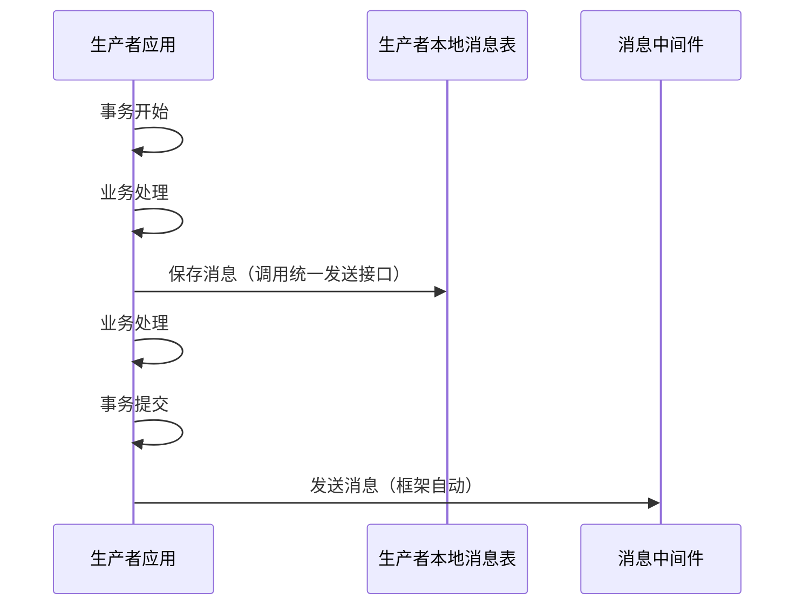
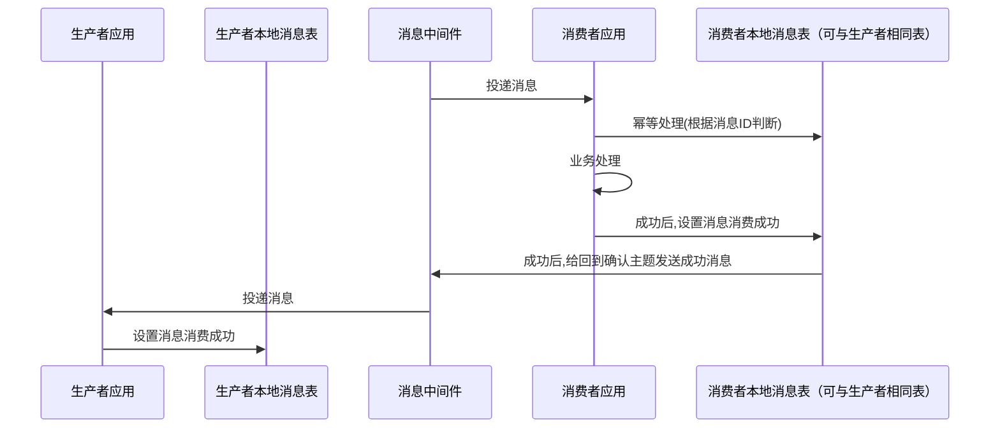
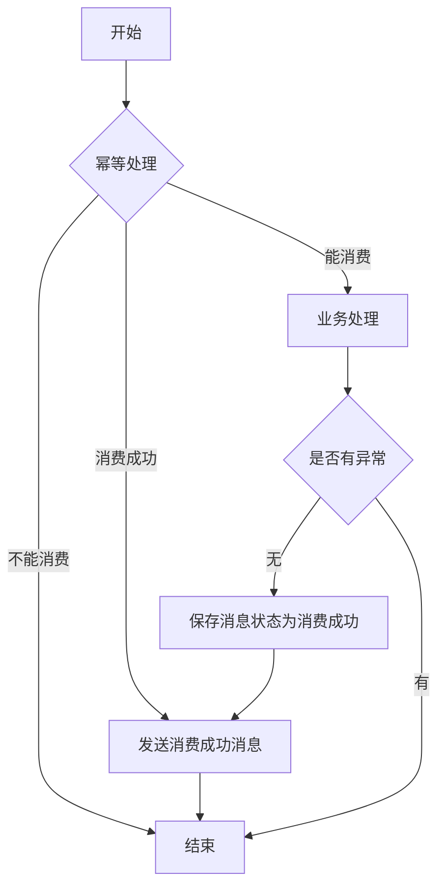
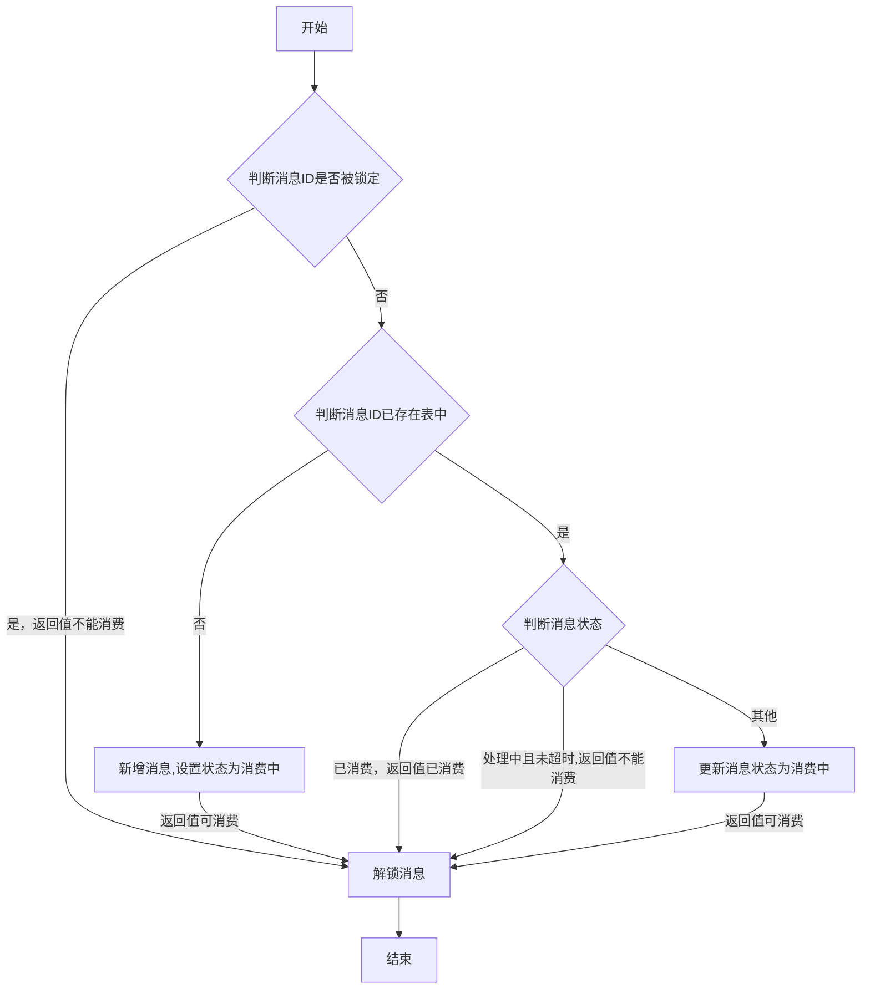
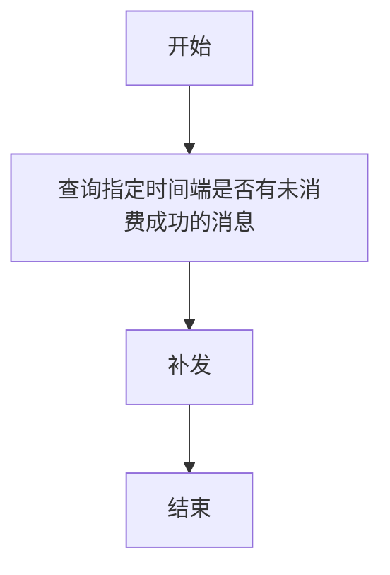

# mq-springboot-reliable

#### 介绍
MQ消息中间件在应用时，用户经常有出现各种问题，本框架通过本地消息表+兜底机制来保障数据的一致性。

#### 问题域
- 发送
  1.  调用消息发送接口，但同步发送性能差，异步发送确认处理复杂
  2.  业务失败但消息发出了

- 消费
  1.  消息中间件保障对同一消息“至少投递一次”，可能会出现多次业务处理
  2.  投递失败，可能出现死循环消费或者超限丢弃转死信队列

#### 解决方案
核心：本地消息表+消息消费成功确认+兜底机制（未成功确认补发消息或人工处理）

注意：只有消费成功才会确认，对未消费成功进行超时补发或人工处理
##### 消息发送

1.  消息保存和生产者业务处理在同一个数据库事务里面，事务提交后再发送消息，保证数据一致性
2.  框架提供同一个发送接口，统一处理发送消息，会自动在在事务提交后发送消息；
3.  同一个发送接口，需要传入如下参数： 
  -  主题：必须，Topic(rockemq)/Exchange(rabbitmq)
  -  标签: 可选，Tag(rockemq)/RouteKey(rabbitmq)
  -  回调确认主题：必须，Topic(rockemq)/Exchange(rabbitmq)
  -  回调确认标签：可选，Tag(rockemq)/RouteKey(rabbitmq)
  -  消息数据：必须，Data
  -  业务ID: 可选

##### 消息消费

消费者端消费处理逻辑

幂等处理：判断消息是否可以进行消费。返回可消费，不能消费，消费成功。

##### 兜底机制
定时轮询未消费成功的消息进行补发

#### 安装教程

1.  xxxx
2.  xxxx
3.  xxxx

#### 使用说明

1.  xxxx
2.  xxxx
3.  xxxx

#### 参与贡献

1.  Fork 本仓库
2.  新建 Feat_xxx 分支
3.  提交代码
4.  新建 Pull Request

#### 特技

1.  使用 Readme\_XXX.md 来支持不同的语言，例如 Readme\_en.md, Readme\_zh.md
2.  Gitee 官方博客 [blog.gitee.com](https://blog.gitee.com)
3.  你可以 [https://gitee.com/explore](https://gitee.com/explore) 这个地址来了解 Gitee 上的优秀开源项目
4.  [GVP](https://gitee.com/gvp) 全称是 Gitee 最有价值开源项目，是综合评定出的优秀开源项目
5.  Gitee 官方提供的使用手册 [https://gitee.com/help](https://gitee.com/help)
6.  Gitee 封面人物是一档用来展示 Gitee 会员风采的栏目 [https://gitee.com/gitee-stars/](https://gitee.com/gitee-stars/)
